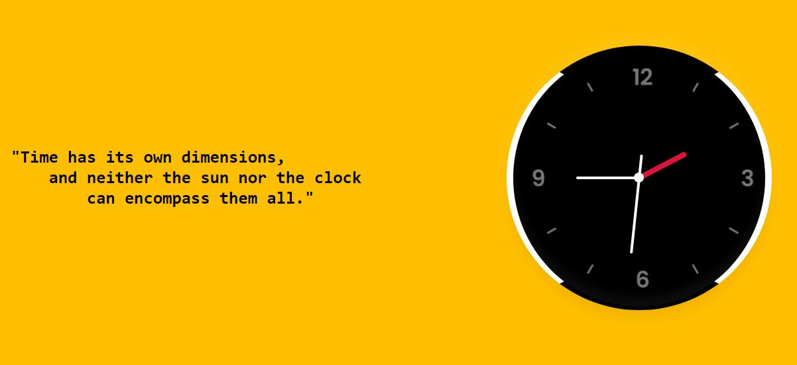

# Clock-in-js

This is a simple project on clock function, which displays a Analog clock, made with HTML, CSS & Javascipt languages.

Check out: https://naughty-wozniak-056e0e.netlify.app/

Thank you for visitng:blush:
